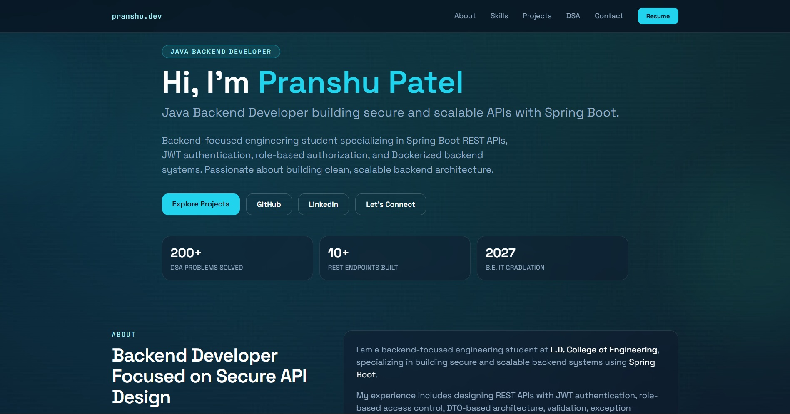

# Pranshu Patel Portfolio Website

A personal developer portfolio showcasing backend engineering projects, skills, and achievements.

This portfolio highlights work focused on **Java backend development**, **Spring Boot API architecture**, and **secure system design**.

---

## Live Website

Not deployed yet.

---

## Preview



---

## Features

- Responsive portfolio website built with Next.js
- Smooth scrolling navigation
- Backend-focused project showcase
- GitHub project links
- Resume download
- Contact form powered by EmailJS
- Skills and backend technology stack
- DSA achievements section
- SEO metadata configuration

---

## Tech Stack

Frontend Framework

- Next.js (App Router)

Language

- TypeScript

Styling

- TailwindCSS

Animation

- Framer Motion

Form Handling

- React Hook Form

Email Integration

- EmailJS

---

## Project Structure

```
app/
components/
data/
public/
  images/
resources/
types/
```

Main UI Sections

- Navbar
- Hero
- About
- Skills
- Projects
- DSA Achievements
- Contact

---

## Running the Project Locally

Clone the repository

```bash
git clone https://github.com/pranshu-2853/portfolio-website.git
```

Install dependencies

```bash
npm install
```

Run the development server

```bash
npm run dev
```

Open the project

```
http://localhost:3000
```

---

## Environment Variables

Create a `.env.local` file in the project root.

```
NEXT_PUBLIC_EMAILJS_SERVICE_ID=
NEXT_PUBLIC_EMAILJS_TEMPLATE_ID=
NEXT_PUBLIC_EMAILJS_PUBLIC_KEY=
```

These values are required for the contact form to send emails using EmailJS.

---

## Contact

LinkedIn

```
https://www.linkedin.com/in/pranshu-patel-gec-ldce-it-dte/
```

GitHub

```
https://github.com/pranshu-2853
```

---

## Author

Pranshu Patel  
Backend Developer focused on Spring Boot APIs, secure backend architecture, and scalable services.